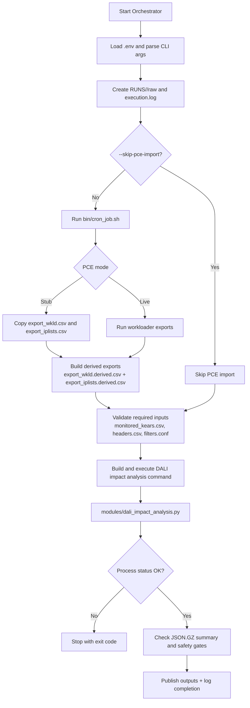
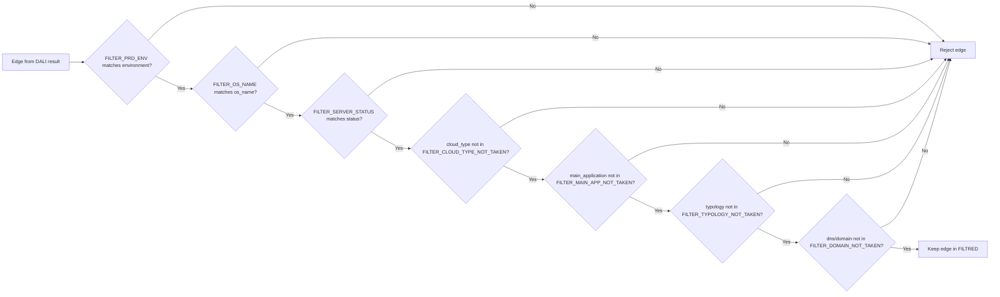
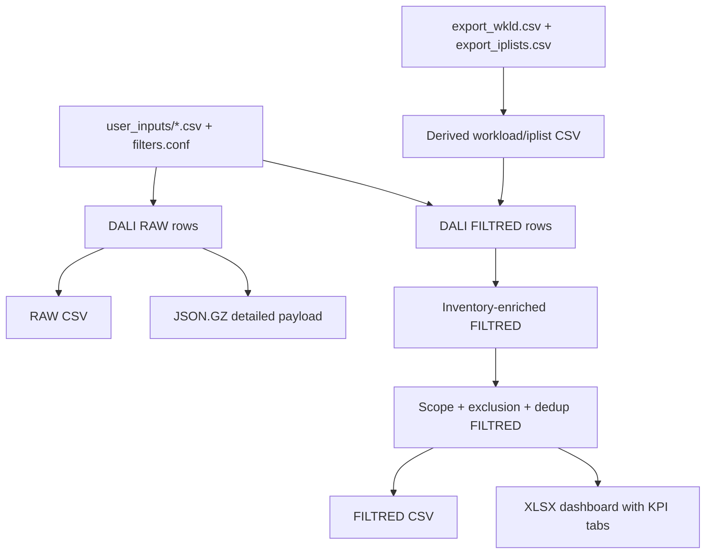

# KPI Pipeline Flowchart (End-to-End)

## Purpose

This flowchart documents the complete KPI calculation and generation process currently implemented in the project, from orchestration bootstrap to multi-sheet XLSX publication.

## 1) Global Orchestration Flow



## 2) DALI Impact & KPI Data Processing Flow

```mermaid
flowchart TD
    A1[Load .env + parse args] --> A2[Read headers mapping]
    A2 --> A3[Read monitored KEAR/UID rows]
    A3 --> A4[Load filters.conf]
    A4 --> B1[Run DALI impact batch]

    B1 --> B2[For each monitored UID:<br/>build params + call DALI (or dry-run)]
    B2 --> B3[Extract RAW rows from DALI edges]
    B2 --> B4[Extract FILTRED rows with filter predicates]
    B3 --> C1[RAW dataset ready]
    B4 --> C2[FILTRED dataset ready]

    C2 --> D1[Inventory enrichment for Gen2 via Data4Sec]
    D1 --> D2[Populate INV_* columns and Retrieved from]
    D2 --> D3[Apply beneficiary exclusions and PROD account scope]

    D3 --> E1[Enrich FILTRED with workload match<br/>managed/IPLIST/SUBNET/etc]
    E1 --> E2[Build Dict_Kear_Account]
    E2 --> E3[Marley UUID lookup + filtering]
    E3 --> E4[Append eligible Marley rows to FILTRED]

    E4 --> F1[Compute In scope + initialize F_Excluded]
    F1 --> F2[Deduplicate FILTRED rows (network/IPLIST ranking)]
    F2 --> F3[Apply manual server exclusion list]

    C1 --> G1[Write RAW CSV]
    F3 --> G2[Write FILTRED CSV]
    B1 --> G3[Write JSON.GZ payload]

    G1 --> H1[Build recap sheets<br/>STATS, TOTAL.PROGRAM, TOTAL.ENTITY]
    G2 --> H1
    F3 --> H2[Build EXCLUDED, get_inv_by_account,<br/>get_marley_gen2_by_uuid, Dict_Kear_Account,<br/>KearLabelsAccounts]

    H1 --> I1[Assemble XLSX workbook<br/>Summary + RAW + FILTRED + diagnostics]
    H2 --> I1
    G3 --> I2[Print execution summary to stdout]
    I1 --> I2
```

## 3) Filter Decision Logic (Applied on DALI Edges)



## 4) Artifact Lineage (What is produced)



---

## Presentation Notes

- The first diagram is best for executive storytelling (macro process reliability and controls).
- The second and third diagrams are best for technical workshops (data lineage and rule engine transparency).
- The fourth diagram is best for governance and auditability (input/output traceability).
